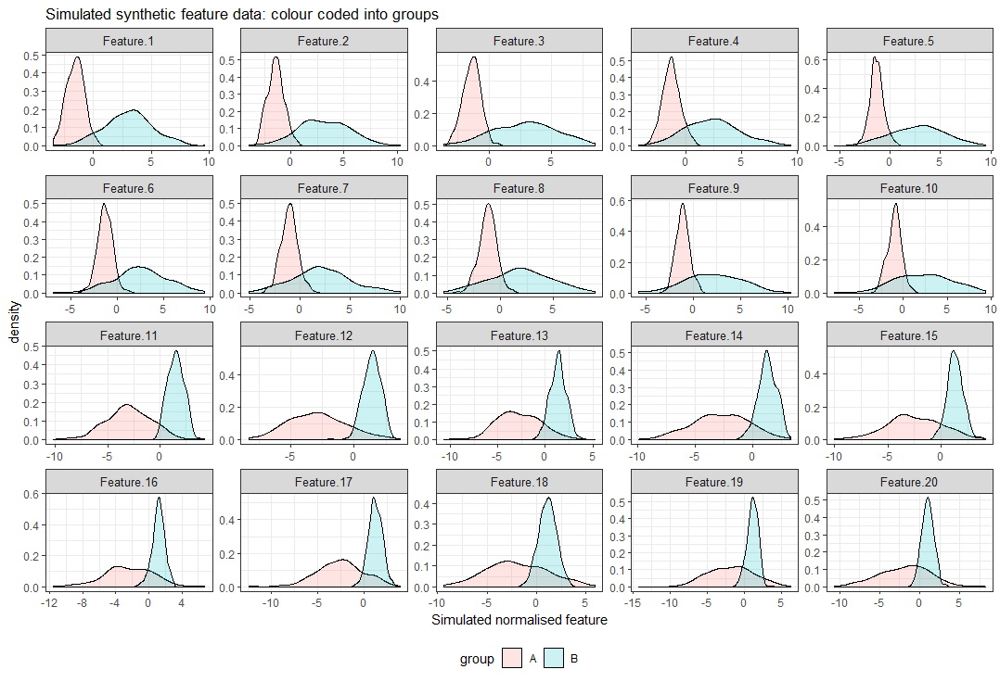
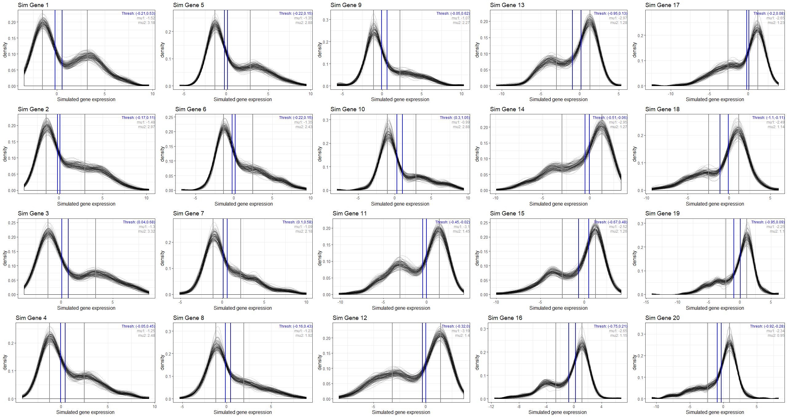
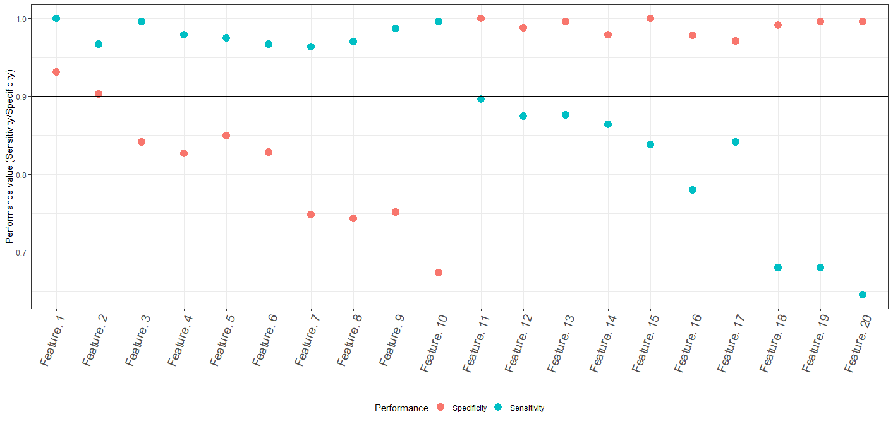
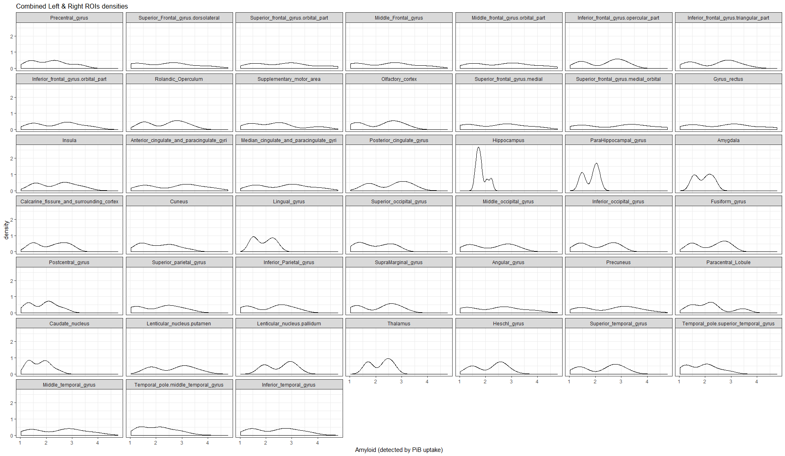
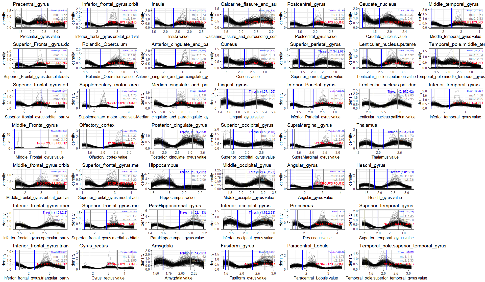

# FSPmix
 Fast unsupervised feature selection using mixture models
 
## Install FSPmix

```{r}
library(devtools)
library(roxygen2)
install_github('MarcelaCespedes/FSPmix')
library(FSPmix)
```

## Simple simulated data example

Simulation study 1: Simulate 20 gene data for `no.ppl` participants

```{r}
no.ppl = 500
op<- SimulationStudy1(sEEd = 948575, no.ppl = no.ppl)

op$plot.ColourCoded.genes
#op$plot.WhatFSPmixSees
```


```{r}
dat<- op$dat
dim(dat)
dat[1:5, c(1:3, 21, 22)] 
#   Feature.1 Feature.2 Feature.3 ppl group
#1 -2.0998962 -1.526716 -2.416620   1     A
#2 -2.5889306 -2.127243 -1.975803   2     A
#3 -1.3694953 -1.694779 -2.476104   3     A
#4 -0.4527216 -1.414173 -1.451656   4     A
#5 -1.2560887 -2.059748 -1.482444   5     A
```

Set up simulation variables for FSPmix_Sim

```{r}
feature.dat<- op$dat[, 1:20]
class<- op$dat$group
boot.size<- round(no.ppl*0.8) # size of boot size sample
no.bootstrap<- 100 #500 # as per paper - this takes a while
```

Run FSPmix algorithm

```{r}
sim.op<- FSPmix_Sim(boot.size = boot.size,
                    no.bootstrap = no.bootstrap,
                    dat = feature.dat, 
                    class = class)

length(sim.op)
sim.op$summ.op # <-- view summary of output
```

View simulation results

```{r}
multiplot(plotlist = sim.op$all.plots, cols = 5)
```



Assess prediction performance of groups A, B and C

```{r}
length(sim.op$all.pred.st)
# Summary of predictions for each simulated Gene
summary.pred <- sapply(sim.op$all.pred.st, function (x) table(x$Pred))
colnames(summary.pred)<- paste("Gene.",1:20, sep = "")
t(summary.pred)
#         Pred.A Pred.B Pred.C
# Gene.1     255    217     28
# Gene.2     261    232      7
# Gene.3     284    197     19
# Gene.4     271    201     28
# Gene.5     272    214     14
# Gene.6     274    210     16
# Gene.7     292    187     21
# Gene.8     291    186     23
# Gene.9     289    178     33
# Gene.10    317    158     25
# Gene.11    215    271     14
# Gene.12    218    277      5
# Gene.13    192    263     45
# Gene.14    208    269     23
# Gene.15    186    254     60
# Gene.16    179    273     48
# Gene.17    213    273     14
# Gene.18    157    299     44
# Gene.19    150    293     57
# Gene.20    148    321     31
```

Assess specificity and sensitivity

```{r}
pred.A<- pred.B<- pred.C<- matrix(NA, nrow = 1, ncol = 4)
colnames(pred.A)<- colnames(pred.B)<- colnames(pred.C)<- c("Gene", "ppl", "Pred", "id")

Specificity.Sensitivity.Res<- list()
Fig1.dat<- data.frame(Feature = paste("Feature.", 1:20),
                      Specificity = rep(NA, 20),
                      Sensitivity = rep(NA, 20))

for(i in 1:20){
  temp.d<- sim.op$all.pred.st[[i]]
  
  tA<- subset(temp.d, Pred == "Pred.A")
  tB<- subset(temp.d, Pred == "Pred.B")
  tC<- subset(temp.d, Pred == "Pred.C")
  
  ## Get their spcificity/ sensitivity
  pred.prot.i = rbind(tA, tB)
  temp.dat<- subset(dat, ppl %in% pred.prot.i$ppl) # need to remove all those in limbo
  
  performance = spec_sens(real.dat = temp.dat, pred.dat = pred.prot.i)
  Specificity.Sensitivity.Res[[i]] <- performance$conf.mat.ratio
  Fig1.dat$Sensitivity[i]<- performance$conf.mat.ratio[1,1]
  Fig1.dat$Specificity[i]<- performance$conf.mat.ratio[2,2]
  ###
  pred.A<- rbind(pred.A, tA)
  pred.B<- rbind(pred.B, tB)
  pred.C<- rbind(pred.C, tC)
}

pred.A<- pred.A[-1,]
pred.B<- pred.B[-1,]
pred.C<- pred.C[-1,]
```

View summaries of specificity and sensitivity output for all simulated genes

```{r}
names(Specificity.Sensitivity.Res)<- paste("Gene.",1:20, sep = "")
Specificity.Sensitivity.Res

#$Gene.1
#      pred.A pred.B
#sol.A  1.000  0.000
#sol.B  0.069  0.931
#
#$Gene.2
#      pred.A pred.B
#sol.A  0.967  0.033
#sol.B  0.097  0.903
# ...
```

Replicate Figure 1 in manuscript

```{r}
Fig1.dat<- melt(Fig1.dat, id.vars = "Feature")
Fig1.dat$Feature<- factor(Fig1.dat$Feature, levels = unique(Fig1.dat$Feature) )
colnames(Fig1.dat)[2]<- "Performance"
Fig1.dat$Performance<- factor(Fig1.dat$Performance, levels = c("Sensitivity", "Specificity"))


ggplot(Fig1.dat, aes(x = Feature, y = value, colour = Performance)) +
  geom_point(size=4) +
  geom_hline(yintercept = 0.9) +
  theme_bw() +
  xlab("") + ylab("Performance value (Sensitivity/Specificity)")+
  theme(legend.position="bottom") +
  theme(axis.text.x = element_text(angle = 70,hjust = 1, size = 14) ) 
```


## Example on real data

Amyloid uptake measured by Positrom Emission Topography (PET) imaging for 5 participants on 89 regions of interest (ROIs) was parcellated by the Automated Anatomical Atlas (AAL), see [here](https://www.sciencedirect.com/science/article/pii/S1053811901909784) for list of region names. Data was taken from [MilxXplore](https://milxview.csiro.au/MilxXplore/Demo/xplorer_study/AIBL/Demo) website; this data is publicly available and was downloaded 13 August 2019. These participants were affiliated with the longitudinal Australian Imaging and Biomarkers Lifestyle study of ageing [(AIBL)](https://aibl.csiro.au/). Each participant has at least two or more follow-ups and for the purpose of demonstrating the utility of the FSPmix, here, we treated each set of ROI observations (features) as independent and identically distributed. 

Load and process the data
```{r}
# Downloaded from https://milxview.csiro.au/MilxXplore/Demo/xplorer_study/AIBL/Demo
# Monday 13 August 2019
pet.ROI<- read.csv(file = "PiB_uptake.csv", header=TRUE, sep = ",")
# Remove Vermis, cerebellum and other columns which are not needed
pet.ROI<- pet.ROI[, -c(5,6, 97:123)]
# combine left and right ROIs together to increase sample size
# Currently have 16 observations per ROI - by combining the left and right, we double to 32 obs per ROI
left.ROIs<- pet.ROI[, seq(from =5, to=93, by=2)]
colnames(left.ROIs)<- substr(colnames(left.ROIs), start=1, stop = nchar(colnames(left.ROIs))-5)
colnames(left.ROIs)[7]<- "Inferior_frontal_gyrus.triangular_part"
right.ROIs<- pet.ROI[, seq(from =6, to=94, by=2)]
colnames(right.ROIs)<- substr(colnames(right.ROIs), start=1, stop = nchar(colnames(right.ROIs))-6)

feature.dat<- rbind(left.ROIs, right.ROIs)
##
## Number of features
dim(feature.dat)[2]  # 45
```

View the data prior to running algorithm
```{r}
plot.fd<- melt(feature.dat)
ggplot(plot.fd, aes(x = value)) + geom_density(alpha = 0.8) +
  facet_wrap(.~variable)+ #, scales="free") +
  theme_bw() +
  ggtitle("Combined Left & Right ROIs densities")
```


Run FSPmix (in serial) - treat each observation as iid

```{r}
no.ppl<- dim(feature.dat)[1]
boot.size<- round(no.ppl*0.8)
no.bootstrap<- 300

sim.op<- FSPmix(dat=feature.dat,
                boot.size = boot.size,
                no.bootstrap= no.bootstrap)

length(sim.op) # length of number of Features to analyse
```

View summary of output, namely which features (ROIs) FSPmix found two groups, as well as final density plots
```{r}
plot.all<- list()
for(i in 1:45){
  tmp.op<- sim.op[[i]]
  plot.all[[i]]<- tmp.op$Plot
  print(tmp.op$two.groups)
}
multiplot(plotlist = plot.all, cols = 7)
```

